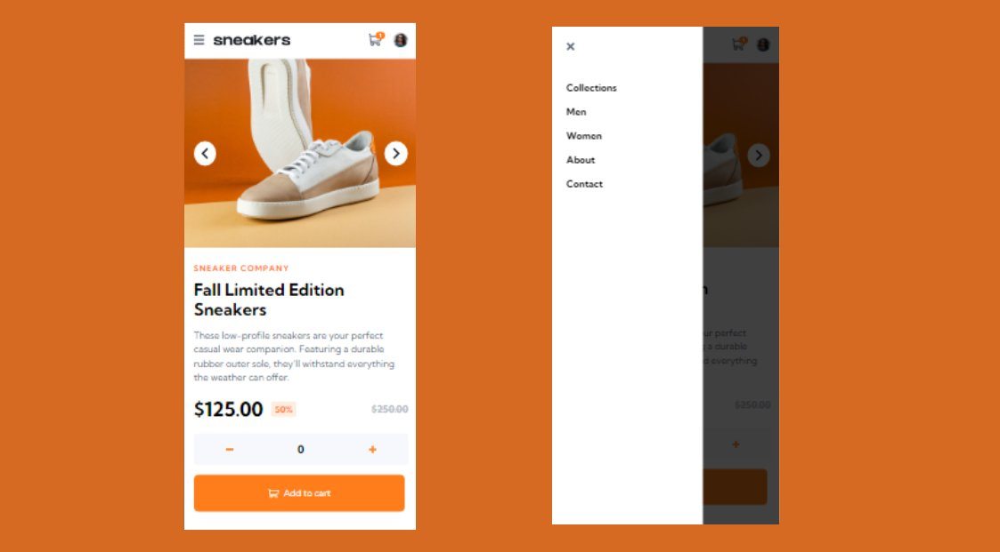

# Frontend Mentor - E-commerce product page solution

This is a solution to the [E-commerce product page challenge on Frontend Mentor](https://www.frontendmentor.io/challenges/ecommerce-product-page-UPsZ9MJp6).

## Table of contents

- [Overview](#overview)
  - [The challenge](#the-challenge)
  - [Screenshot](#screenshot)
  - [Links](#links)
- [My process](#my-process)
  - [Built with](#built-with)
  - [What I learned](#what-i-learned)
  - [Continued development](#continued-development)
  - [Useful resources](#useful-resources)
- [Author](#author)
- [Acknowledgments](#acknowledgments)


## Overview

### The challenge

Users should be able to:

- View the optimal layout for the site depending on their device's screen size
- See hover states for all interactive elements on the page
- Open a lightbox gallery by clicking on the large product image
- Switch the large product image by clicking on the small thumbnail images
- Add items to the cart
- View the cart and remove items from it

### Screenshot




### Links

- Solution URL: [Add solution URL here](https://your-solution-url.com)
- Live Site URL: [Add live site URL here](https://your-live-site-url.com)

## My process

### Built with

- Semantic HTML5 markup
- CSS custom properties
- Flexbox
- CSS Grid
- Mobile-first workflow
- [React](https://reactjs.org/) - JS library
- [Next.js](https://nextjs.org/) - React framework
- [Styled Components](https://styled-components.com/) - For styles
- [Modern css reset](https://piccalil.li/blog/a-modern-css-reset/) - piccalil


### What I learned

A lot of javascript tricks inside arrowFunction().

```html
<div class="main">
            <div class="product-img-container">
                
                
                
                

                <div id="mobile-previous-arrow" class="previous-container | mobile-arrow-container">
                    <svg class="previous" width="12" height="18" xmlns="http://www.w3.org/2000/svg" stroke="#1D2026"><path d="M11 1 3 9l8 8" stroke-width="3" fill="none" fill-rule="evenodd"/></svg>
                </div>
                <div id="mobile-next-arrow" class="next-container | mobile-arrow-container">
                    <svg class="next" width="12" height="18" xmlns="http://www.w3.org/2000/svg" stroke="#1D2026"><path d="m2 1 8 8-8 8"  stroke-width="3" fill="none" fill-rule="evenodd"/></svg>
                </div>

                <div class="image-pre-container | not-pop-up-image-pre-container" preview="true">
                    
                    <div class="mask"></div>
                </div>
                <div class="image-pre-container | not-pop-up-image-pre-container" preview="false">
                    
                    <div class="mask"></div>
                </div>
                <div class="image-pre-container | not-pop-up-image-pre-container" preview="false">
                    
                    <div class="mask"></div>
                </div>
                <div class="image-pre-container | not-pop-up-image-pre-container" preview="false">
                    
                    <div class="mask"></div>
                </div>
            </div> <!-- product-img-container -->
```
```css
.pop-up-container{
    column-gap: .1rem;
    grid-template-columns:repeat(4,20%);
    place-items: center;
    justify-content: center;
}
.pop-product-img-preview{
    min-width: 25rem;
}
.pop-up {
    max-width: 4rem;
}
.next-container, .previous-container {
    position: absolute;
    display: flex;
    align-items: center;
    justify-content: center;
    top: 40%;
    transform: translateY(-50%);
    background-color: var(--neutral-100);
    padding: .7rem .8rem;
    border-radius: 50%;
}

.next-container{
    right:-1rem;
}
.previous-container{
    padding-left: .7rem;
    left: -1rem;
}
.close{
    position: absolute;
    top: -2rem;
    right: 0;
    fill: var(--neutral-100);
}
.menu-button{
    display: none;
}
.mobile-arrow-container{
    display: none;
}

.pop-product-img-preview[preview='false']{
    display: none;
}
.inside-cart[preview="false"]{
    display: none;
}
```
```js
// arrow mobile function
function arrowFunction(arrow, className, direction, device){
    arrow.addEventListener('click',function(){
        const productPreImages = document.getElementsByClassName(className);
        const statesList = getCurrentStatesPreview(productPreImages);
        const miniPreImagePopUp = document.getElementsByClassName('pop-up-image-pre-container');
        let indexOfDisplay = statesList.indexOf('true');
        productPreImages[indexOfDisplay].setAttribute('preview','false');
        miniPreImagePopUp[indexOfDisplay].setAttribute('preview','false');
        if (device == 0){
            if (direction == false) {
                if (indexOfDisplay != 0){
                    productPreImages[indexOfDisplay - 1].setAttribute('preview','true');
                }else{
                    productPreImages[3].setAttribute('preview','true');
                }
            } else if (direction == true){
                if (indexOfDisplay != 3){
                    productPreImages[indexOfDisplay + 1].setAttribute('preview','true');
                }else{
                    productPreImages[0].setAttribute('preview','true');
                }
            }
        }else if (device == 1){
            console.log('ipased')
            if (direction == false) {
                if (indexOfDisplay != 0){
                    productPreImages[indexOfDisplay - 1].setAttribute('preview','true');
                    miniPreImagePopUp[indexOfDisplay - 1].setAttribute('preview','true');
                }else{
                    productPreImages[3].setAttribute('preview','true');
                    miniPreImagePopUp[3].setAttribute('preview','true');
                }
            } else if (direction == true){
                if (indexOfDisplay != 3){
                    productPreImages[indexOfDisplay + 1].setAttribute('preview','true');
                    miniPreImagePopUp[indexOfDisplay + 1].setAttribute('preview','true');
                }else{
                    productPreImages[0].setAttribute('preview','true');
                    miniPreImagePopUp[0].setAttribute('preview','true');
                }
            }
        }
    })
}
```

### Continued development

My first project with menu, Im so glad for finishing this work. Specialy the mobile version with the side menu on the right.


### Useful resources

- [W3schools](https://www.w3schools.com/) - This helped me for javaScript eventListener. I really liked this pattern and will use it going forward.
- [stackoverflow](https://stackoverflow.com/) - this website help me on the javascript when i get stock.
## Author

- Website - [Mohamed Sagou](https://github.com/medsagou)
- Frontend Mentor - [@medsagou](https://www.frontendmentor.io/profile/medsagou)
- Twitter - [@sagoumohamed](https://www.twitter.com/sagoumohamed)

## Acknowledgments

nothing for this project.